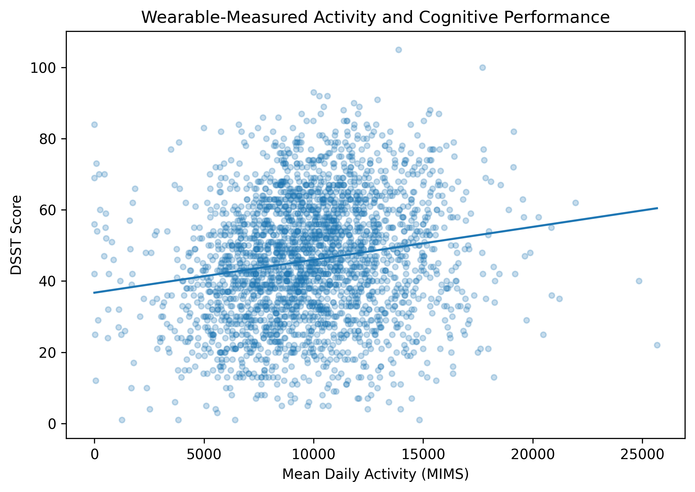
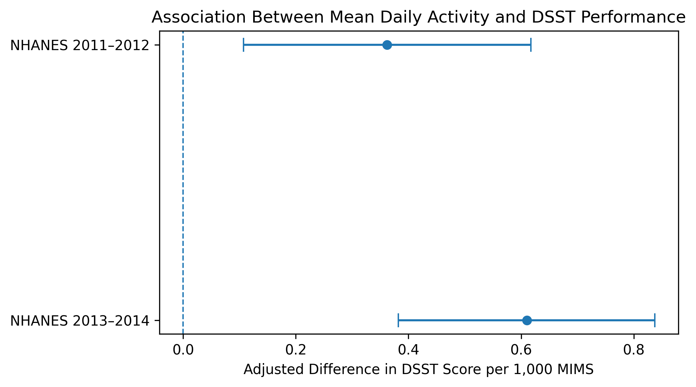
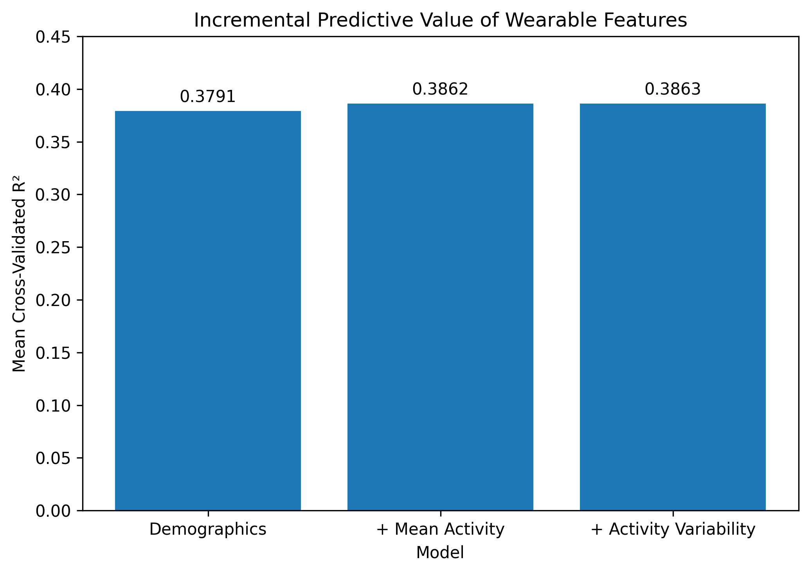

# Digital Biomarkers of Cognitive Function in Older Adults

## Overview

This project investigates whether wearable-derived physical activity features can serve as digital biomarkers of cognitive function in older adults.

Using NHANES 2011–2014 data, wrist-worn accelerometer measurements were integrated with standardized cognitive assessments and demographic data to evaluate both the **statistical association** and **predictive utility** of wearable-derived activity features.

The analysis included an independent replication across NHANES survey cycles and out-of-sample predictive modeling.

## Research Question

**Can wearable-derived physical activity features provide information about cognitive performance beyond age, sex, and education in adults aged 60–80?**

## Key Findings

- Higher mean daily wearable-measured activity was significantly associated with better DSST cognitive performance in both independent NHANES cohorts.
- In NHANES 2013–2014, each additional 1,000 MIMS of mean daily activity was associated with a **0.610-point higher DSST score** after adjustment for age, sex, and education (95% CI: 0.382–0.837).
- The association replicated in NHANES 2011–2012 (**β = 0.362**, 95% CI: 0.107–0.617).
- Adding mean daily activity to demographic predictors produced a **small improvement in five-fold cross-validated prediction**, increasing mean R² from **0.3791 to 0.3862**.
- Cross-cohort validation showed modest and variable predictive improvement across survey cycles.
- Adding simple measures of day-to-day activity variability provided essentially no additional predictive benefit (R² = 0.3863).

Overall, wearable-measured activity demonstrated a reproducible relationship with cognitive performance, but its incremental predictive value beyond basic demographic characteristics was modest.

## Dataset

**National Health and Nutrition Examination Survey (NHANES), 2011–2014**

Data sources included:

- Wrist-worn physical activity monitor data
- Cognitive Functioning Questionnaire data
- Demographic data

NHANES 2013–2014 was used for the primary association analysis, while NHANES 2011–2012 was used as an independent replication cohort.

### Primary Cognitive Outcome

**Digit Symbol Substitution Test (DSST)**

The DSST evaluates cognitive domains including processing speed, sustained attention, and working memory.

## Digital Biomarkers

Wearable-derived features evaluated in this project included:

- Mean daily activity
- Activity standard deviation
- Activity coefficient of variation
- Wearable data-validity measures

Mean daily activity was the primary wearable-derived biomarker.

## Analysis Pipeline

1. NHANES data acquisition and quality control
2. Participant selection and data cleaning
3. Wearable feature engineering
4. Exploratory data analysis
5. Multivariable statistical modeling
6. Independent cohort replication
7. Train/test predictive modeling
8. Five-fold cross-validation
9. Cross-cohort validation
10. Exploratory multi-feature modeling

## Results

### Activity and Cognitive Performance



**Figure 1.** Relationship between mean daily wearable-measured activity and DSST cognitive performance across the pooled NHANES 2011–2014 sample. The line represents the unadjusted linear trend.

### Independent Replication



**Figure 2.** Adjusted association between mean daily activity and DSST performance in two independent NHANES cohorts. Error bars represent 95% confidence intervals.

Both cohorts demonstrated a significant positive adjusted association between mean daily activity and DSST performance.

### Predictive Modeling



**Figure 3.** Mean out-of-sample R² from five-fold cross-validation.

| Model | Mean CV R² |
|---|---:|
| Demographics | 0.3791 |
| Demographics + Mean Activity | 0.3862 |
| Demographics + Activity + Variability | 0.3863 |

Mean daily activity provided a small improvement over demographic predictors alone, while additional activity-variability features provided essentially no further improvement.

## Interpretation

The findings highlight an important distinction between **statistical association and predictive utility**.

Mean daily wearable-measured activity showed a reproducible positive association with cognitive performance across two independent cohorts. However, the same biomarker provided only modest incremental information for predicting cognitive performance beyond age, sex, and education.

This suggests that overall physical activity may capture meaningful behavioral information related to cognitive health while remaining insufficient as a standalone digital biomarker for individual-level cognitive prediction.

## Limitations

- NHANES 2011–2014 provides cross-sectional rather than longitudinal cognitive outcomes.
- Associations cannot establish that greater physical activity causes better cognitive performance.
- Mean daily activity summarizes overall movement but does not capture the full temporal structure of wearable data.
- Cognitive performance is influenced by numerous demographic, behavioral, clinical, and social factors not modeled here.
- The predictive models were intended to evaluate incremental information rather than develop a clinical diagnostic tool.
- NHANES survey design and sampling weights were not incorporated into the predictive modeling portion of this exploratory project.

## Future Work

Future work could investigate richer wearable-derived biomarkers, including:

- Rest-activity and circadian rhythm features
- Sleep characteristics
- Activity timing and fragmentation
- Gait-derived features
- Multimodal digital biomarkers

Longitudinal datasets could also be used to investigate whether wearable-derived features predict **future cognitive decline** rather than cross-sectional cognitive performance.

## Repository Structure

```text
notebooks/
    01_data_exploration.ipynb
    02_replication_2011_2012.ipynb
    03_predictive_modeling.ipynb

literature/
    literature_review.md

results/
    figures/
        figure1_activity_dsst.png
        figure2_replication_effects.png
        figure3_model_performance.png
    tables/
        final_results_summary.csv
